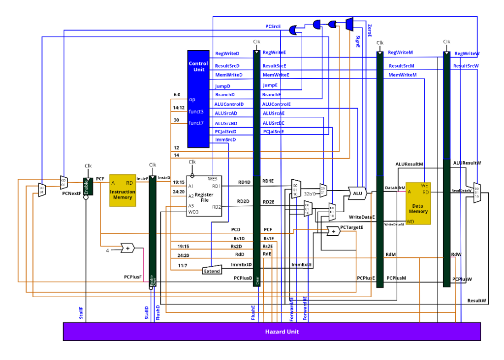
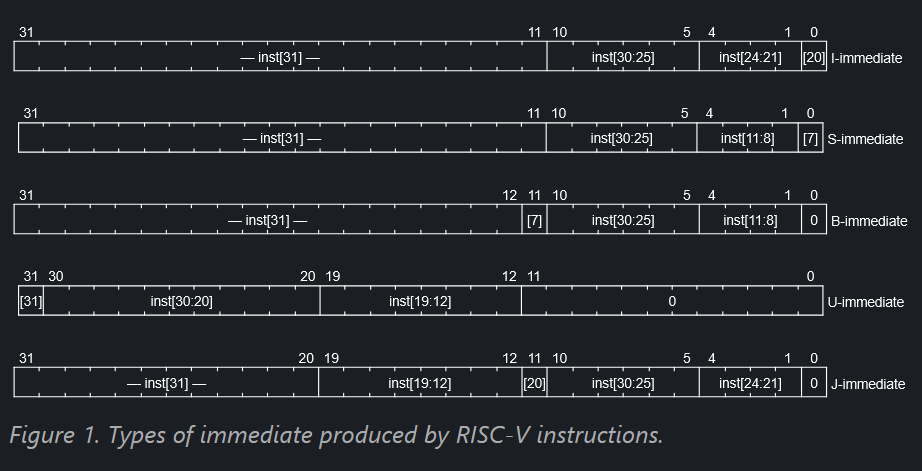

# RV32I 5-Stage Pipelined Processor

This project implements a fully functional **5-stage pipelined RV32I RISC-V processor** in SystemVerilog. The processor supports a subset of the RV32I instruction set, featuring hazard detection and data forwarding to optimize performance and prevent instruction hazards.

---

## 1. Processor Architecture

The processor implements the standard RISC-V 5-stage pipelined architecture:

1. **Instruction Fetch (IF):** Fetches instructions from the Instruction Memory (ROM) using the Program Counter (PC). Includes branch/jump target selection.
2. **Instruction Decode (ID):** Decodes the instruction, reads operands from the Register File, and extracts immediate values.
3. **Execute (EX):** Performs ALU operations, evaluates branch conditions, and computes memory/jump target addresses.
4. **Memory Access (MEM):** Reads from or writes to the Data Memory (RAM) for load and store instructions.
5. **Write Back (WB):** Writes the final ALU result or loaded memory data back into the Register File.

### Datapath & Control Schematic
Below is the architectural schematic of our 5-stage pipelined processor, including the control unit, registers, ALU, memory, and hazard unit:

---

## 2. Immediate Generation Logic

RISC-V instructions use structured layouts where immediate bits are strategically placed to minimize multiplexer complexity. The sign bit (bit 31) is always in the same position across all formats.

The immediate generator (`sv_files/extend.sv`) reconstructs 32-bit sign-extended immediates based on the instruction type:

*   **I-Type (Loads, ALU Immediates):** Reconstructed as `{{20{inst[31]}}, inst[31:20]}`.
*   **S-Type (Stores):** Reconstructed as `{{20{inst[31]}}, inst[31:25], inst[11:7]}`.
*   **B-Type (Branches):** Reconstructed as `{{19{inst[31]}}, inst[31], inst[7], inst[30:25], inst[11:8], 1'b0}`.
*   **U-Type (LUI, AUIPC):** Reconstructed as `{inst[31:12], 12'b0}`.
*   **J-Type (Unconditional Jumps):** Reconstructed as `{{11{inst[31]}}, inst[31], inst[19:12], inst[20], inst[30:21], 1'b0}`.

### RISC-V Immediate Formats
The layout of bits for each immediate format is shown below:

---

## 3. Directory Structure

*   `sv_files/`: Core SystemVerilog RTL modules.
    *   `top.sv`: Top-level processor block.
    *   `fetch.sv`, `decode.sv`, `control.sv`, `extend.sv`, `alu.sv`, `register_file.sv`, `data_memory.sv`, `instruction_memory.sv`, `hazard_control.sv`, `branch_control.sv`.
*   `tb_files/`: Testbenches for verification.
    *   `tb_MaxArray.sv`: General top-level testbench finding the maximum in an array.
    *   `tb_stall_issue.sv`: Testbench demonstrating the conservative load-use stall issue.
*   `assets/`: Diagrams and documentation assets.
